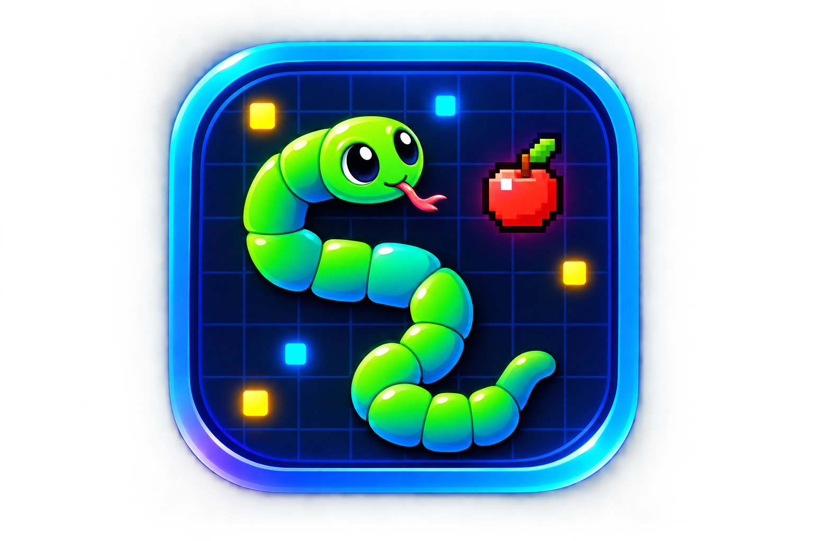

# 🐍 BLOCK SNAKE 3D

### 🎮 Retro Voxel Snake Game • 3D WebGL • Arcade Gameplay

<p align="center">
  
</p>

<p align="center">
  <strong>🐍 COLLECT • GROW • SURVIVE 🍎</strong>
</p>

<p align="center">
  A neon-powered 3D voxel snake game built for the browser.
</p>

<p align="center">
  <a href="https://github.com/rsamwilson2323-cloud/BLOCK-SNAKE-3D">Repository</a>
  •
  <a href="https://github.com/rsamwilson2323-cloud/BLOCK-SNAKE-3D/issues">Issues</a>
  •
  <a href="https://github.com/rsamwilson2323-cloud/BLOCK-SNAKE-3D/blob/main/LICENSE">MIT License</a>
</p>

---

# 🐍 About The Game

**BLOCK SNAKE 3D** is a browser-based **3D voxel snake game** built using:

* 🌐 HTML5
* 🎨 CSS3
* ⚡ JavaScript
* 🎮 Three.js
* 🧊 WebGL
* 🖥️ PowerShell

The game combines the classic snake gameplay concept with a modern **3D voxel environment**, neon arcade visuals, boost mechanics, jumping, obstacles, multiple game modes, and responsive mobile controls.

Navigate through the voxel world, collect apples, grow your snake, avoid collisions, and try to achieve the highest possible score.

---

# ✨ Features

## 🎮 3D Voxel Gameplay

* Explore a block-style 3D environment
* Real-time WebGL rendering
* Retro arcade-inspired graphics
* Neon voxel visual effects
* Dynamic 3D camera and gameplay environment
* Three.js-powered rendering

---

## 🍎 Apple Collection

Collect apples throughout the game world.

Each collection contributes toward your gameplay objectives and helps your snake grow.

The HUD provides real-time information about:

```text
APPLES 0/8
```

and other gameplay statistics.

---

## 🐍 Snake Growth

As you collect apples:

* Your snake grows
* Your score increases
* Your length increases
* Gameplay becomes more challenging
* You must avoid your own body

The goal is to survive while achieving the highest possible score.

---

# 🚀 Boost System

Use the boost ability to temporarily increase movement speed.

### Desktop

```text
SHIFT
```

### Mobile

```text
BOOST
```

The game provides a real-time boost meter:

```text
BOOST 100%
████████████████████
```

---

# 🦘 Jump System

The snake can jump through the voxel environment.

### Desktop

```text
SPACE
```

### Mobile

```text
JUMP
```

The HUD displays the current jump status and recharge meter.

---

# 🎯 Game Modes

BLOCK SNAKE 3D includes multiple gameplay options.

### 🐍 Start Game

Start the standard game experience and progress through the voxel world.

### ♾️ Endless Mode

Play continuously and attempt to achieve the highest possible score and longest snake.

---

# 📊 Live Game HUD

The game provides a real-time arcade-style HUD.

### Score

```text
SCORE
0

HIGH: 0
```

### Snake Status

```text
LENGTH
0

LEVEL
1
```

### Objective

```text
APPLES 0/8
```

### Ability Meters

```text
BOOST 100%

JUMP READY
```

This allows the player to monitor important gameplay information without leaving the game.

---

# ⏸️ Pause System

The game can be paused at any time.

### Keyboard

```text
P
```

or

```text
ESC
```

The pause menu provides:

* ▶️ Resume
* 🔄 Restart

---

# ⚙️ Settings

The game includes an integrated settings interface.

Available options include:

### 🔊 Audio

Toggle game audio.

```text
ON / OFF
```

### 🎨 Graphics

Adjust the graphics quality.

```text
ULTRA
```

### ✨ Bloom

Toggle visual bloom effects.

```text
ON / OFF
```

---

# 📱 Mobile Support

BLOCK SNAKE 3D includes touch controls for mobile devices.

### Virtual Joystick

The left-side joystick controls snake movement.

```text
┌─────────────┐
│             │
│   JOYSTICK  │
│    STEER    │
│             │
└─────────────┘
```

### Action Buttons

The right side provides:

```text
┌─────────┐
│  JUMP   │
└─────────┘

┌─────────┐
│  BOOST  │
└─────────┘
```

The interface is designed to adapt to smaller screens.

---

# 🖥️ Desktop Controls

| Key     | Action             |
| ------- | ------------------ |
| `W`     | Move               |
| `A`     | Move               |
| `S`     | Move               |
| `D`     | Move               |
| `↑`     | Move               |
| `↓`     | Move               |
| `←`     | Move               |
| `→`     | Move               |
| `SHIFT` | Boost              |
| `SPACE` | Jump               |
| `P`     | Pause              |
| `ESC`   | Pause / Exit Pause |

---

# 🎮 Gameplay

The core gameplay loop is:

```text
              🐍 START
                 │
                 ▼
        ENTER VOXEL WORLD
                 │
                 ▼
           FIND APPLES 🍎
                 │
                 ▼
          COLLECT APPLES
                 │
                 ▼
          GROW YOUR SNAKE
                 │
                 ▼
          INCREASE SCORE
                 │
                 ▼
        AVOID YOUR OWN TAIL
                 │
                 ▼
          AVOID OBSTACLES
                 │
                 ▼
              SURVIVE
                 │
                 ▼
         BEAT HIGH SCORE 🏆
```

---

# 🖥️ Game Screens

## 🔄 Loading Screen

The loading screen initializes the game environment.

Example:

```text
INITIALIZING

Generating Voxel Worlds...
████████████████████
```

---

## 🐍 Start Screen

The start screen provides:

* Game title
* Game description
* Controls
* Start Game
* Endless Mode
* Creator information
* License information

---

## ⏸️ Pause Screen

The pause interface provides:

```text
PAUSED

RESUME
RESTART
```

---

## ⚙️ Settings Screen

The settings interface provides:

```text
SETTINGS

Audio       ON
Graphics    ULTRA
Bloom       ON

CLOSE
```

---

## 💀 Game Over Screen

When the player loses, the game displays:

```text
SYSTEM FAILURE

GAME OVER
```

Statistics include:

* Final Score
* High Score
* Apples
* Length

The player can then select:

```text
► RETRY
```

---

# 🎨 Visual Design

BLOCK SNAKE 3D uses a retro-futuristic arcade design.

### Visual characteristics

* 🔵 Neon blue UI
* 🟢 Bright voxel snake
* 🍎 Pixel-style apples
* 🌌 Dark 3D environment
* ✨ Glow effects
* 💡 Bloom effects
* 🔲 Pixel panels
* 🎮 Arcade HUD
* 🧊 Voxel-style objects
* 🌐 WebGL rendering

---

# 🔤 Typography

The interface uses retro gaming fonts:

```text
Press Start 2P
Silkscreen
```

These fonts help create the classic arcade / 16-bit aesthetic.

---

# 🛠️ Technologies Used

| Technology        | Purpose                          |
| ----------------- | -------------------------------- |
| 🌐 HTML5          | Game structure and interface     |
| 🎨 CSS3           | UI styling and responsive design |
| ⚡ JavaScript      | Game logic and interaction       |
| 🎮 Three.js       | 3D rendering                     |
| 🧊 WebGL          | Hardware-accelerated graphics    |
| 🖥️ PowerShell    | Local HTTP server                |
| 📦 Microsoft Edge | Standalone App Mode              |

---

# 🌐 Three.js

The game uses **Three.js** to render the 3D voxel environment.

The project currently imports:

```text
Three.js v0.160.0
```

using a browser import map.

The Three.js modules are loaded from:

```text
https://unpkg.com/three@0.160.0/
```

This means a separate local Three.js installation is not required.

---

# 📂 Project Structure

```text
BLOCK-SNAKE-3D/
│
├── 📁 css/
│   └── styles.css
│
├── 📁 js/
│   └── main.js
│
├── 📄 index.html
├── 📄 README.md
├── 📄 LICENSE
│
├── 🖼️ logo.png
│
├── 🖥️ launch.bat
├── 🖥️ launch.vbs
│
├── ⚡ server.ps1
└── 📄 .gitignore
```

### Main Files

| File             | Description                       |
| ---------------- | --------------------------------- |
| `index.html`     | Main game entry point             |
| `css/styles.css` | Game interface and visual styling |
| `js/main.js`     | Main game logic                   |
| `logo.png`       | Project logo                      |
| `server.ps1`     | Local HTTP server                 |
| `launch.bat`     | Windows game launcher             |
| `launch.vbs`     | Silent launcher                   |
| `LICENSE`        | MIT license                       |
| `.gitignore`     | Ignored temporary files           |

---

# ⚙️ Requirements

To run the game using the included Windows launcher:

* 🪟 Windows
* 🌐 Microsoft Edge
* ⚡ PowerShell
* 💻 Modern computer
* 🧊 WebGL-compatible graphics hardware

The included launcher does **not** require:

```text
Python
Node.js
npm
```

The browser loads Three.js through the configured import map.

---

# 🚀 Installation

## 1. Clone the Repository

```bash
git clone https://github.com/rsamwilson2323-cloud/BLOCK-SNAKE-3D.git
```

Move into the project directory:

```bash
cd BLOCK-SNAKE-3D
```

---

# ▶️ Run the Game

## Method 1 — Windows Launcher

The easiest method is to run:

```text
launch.bat
```

Simply double-click:

```text
launch.bat
```

The launcher handles the local server and game startup automatically.

---

# 🔄 How The Launcher Works

The launcher performs the following process:

```text
launch.bat
     │
     ▼
Start PowerShell Server
     │
     ▼
Wait for Server
     │
     ▼
Start Microsoft Edge
     │
     ▼
Edge App Mode
     │
     ▼
http://localhost:8000
     │
     ▼
BLOCK SNAKE 3D
     │
     ▼
Player Closes Game
     │
     ▼
Stop Background Server
```

This provides a standalone desktop-like experience without requiring a traditional desktop application.

---

# 🖥️ Edge App Mode

The launcher opens the game using Microsoft Edge App Mode.

Instead of opening the game in a normal browser tab, it creates a standalone application-style window.

This means the game can run without the usual:

```text
Address Bar
Tabs
Browser Navigation UI
```

The result feels more like a dedicated desktop game.

---

# ▶️ Manual Server Start

If you do not want to use the launcher, start the server manually.

Open PowerShell in the project directory and run:

```powershell
powershell -ExecutionPolicy Bypass -File server.ps1
```

The local server will be available at:

```text
http://localhost:8000/
```

Then open the address in Microsoft Edge.

---

# 🖥️ Local Server

The project contains a lightweight PowerShell HTTP server.

The server runs on:

```text
localhost:8000
```

It is designed to serve the game's web assets locally.

### Server URL

```text
http://localhost:8000/
```

### Port

```text
8000
```

---

# 📦 Supported Web Assets

The local server is configured to handle common web/game assets such as:

```text
.html
.css
.js
.json
.png
.jpg
.svg
```

Other file types can be served using:

```text
application/octet-stream
```

---

# 🔧 Configuration

The server configuration can be modified in:

```text
server.ps1
```

The default port is:

```powershell
$port = 8000
```

If the port is changed, update the game URL used by:

```text
launch.bat
```

For example:

```text
http://localhost:9000
```

---

# 🛡️ .gitignore

Temporary and operating-system-generated files should not be committed to the repository.

The project ignores files such as:

```text
server.log
.DS_Store
Thumbs.db
*.tmp
```

This helps keep the repository clean.

> 💡 `server.log` is a runtime-generated file and does not need to be included in the source repository.

---

# 🧩 Architecture

The project can be understood as four main layers:

```text
┌────────────────────────────────────────┐
│             BLOCK SNAKE 3D             │
├────────────────────────────────────────┤
│                                        │
│  🎨 UI / HUD                           │
│  HTML + CSS                            │
│                                        │
├────────────────────────────────────────┤
│                                        │
│  🎮 GAME LOGIC                         │
│  JavaScript                            │
│                                        │
├────────────────────────────────────────┤
│                                        │
│  🌐 3D ENGINE                          │
│  Three.js + WebGL                      │
│                                        │
├────────────────────────────────────────┤
│                                        │
│  🖥️ LOCAL SERVER                       │
│  PowerShell                            │
│                                        │
└────────────────────────────────────────┘
```

---

# 🔁 Game Flow

```text
PAGE LOAD
    │
    ▼
INITIALIZING
    │
    ▼
GENERATE VOXEL WORLD
    │
    ▼
START SCREEN
    │
    ├───────────────┐
    ▼               ▼
START GAME      ENDLESS MODE
    │               │
    └───────┬───────┘
            ▼
       GAMEPLAY
            │
      ┌─────┼─────┐
      ▼     ▼     ▼
   APPLE  BOOST  JUMP
      │     │     │
      └─────┼─────┘
            ▼
       COLLISION?
        /       \
      YES        NO
       │          │
       ▼          │
   GAME OVER      │
       │          │
       ▼          │
     RETRY ◄──────┘
```

---

# 🏆 Scoring

The game tracks several important gameplay statistics:

```text
SCORE
HIGH SCORE
APPLES
LENGTH
LEVEL
```

These values are displayed through the live HUD and the Game Over screen.

---

# 📊 Game Over Statistics

After a game ends, the statistics panel displays:

| Statistic      | Description                    |
| -------------- | ------------------------------ |
| 🏆 Final Score | Score achieved during the game |
| 👑 High Score  | Highest recorded score         |
| 🍎 Apples      | Apples collected               |
| 🐍 Length      | Final snake length             |

---

# 🎮 Player Experience

The intended gameplay experience is:

```text
        🐍
        │
        ▼
   EXPLORE WORLD
        │
        ▼
     FIND 🍎
        │
        ▼
    COLLECT IT
        │
        ▼
   SNAKE GROWS
        │
        ▼
    SCORE RISES
        │
        ▼
   GO FASTER 🚀
        │
        ▼
      JUMP 🦘
        │
        ▼
 AVOID COLLISIONS
        │
        ▼
   BEAT YOUR SCORE
```

---

# 📱 Responsive Gameplay

The project includes dedicated touch controls for smaller screens.

The interface can switch between:

### Desktop

```text
Keyboard Controls
W A S D
Arrow Keys
SHIFT
SPACE
P / ESC
```

### Mobile

```text
Virtual Joystick
JUMP
BOOST
```

This allows the same game to be experienced across different device types.

---

# 🔊 Audio

The game includes an audio control within the HUD and settings interface.

Players can toggle audio from:

```text
HUD → Audio Button
```

or:

```text
Settings → Audio
```

---

# ✨ Graphics & Bloom

The Settings screen includes graphics and bloom controls.

```text
Graphics → ULTRA

Bloom → ON
```

Bloom contributes to the game's neon arcade visual appearance.

---

# 🧪 Development

To modify the project:

### HTML

Edit:

```text
index.html
```

### Styling

Edit:

```text
css/styles.css
```

### Game Logic

Edit:

```text
js/main.js
```

### Local Server

Edit:

```text
server.ps1
```

### Launcher

Edit:

```text
launch.bat
```

or:

```text
launch.vbs
```

---

# 🐛 Troubleshooting

## ❌ Game Does Not Open

Make sure Microsoft Edge is installed.

Then try opening:

```text
http://localhost:8000/
```

manually.

---

## ❌ Port 8000 Already In Use

Another application may already be using port `8000`.

Change the port in:

```text
server.ps1
```

and update the corresponding URL in:

```text
launch.bat
```

---

## ❌ Game Shows a Blank Screen

Check that:

```text
index.html
css/
js/
```

exist in the correct locations.

Also check the browser developer console for JavaScript errors.

---

## ❌ Three.js Does Not Load

The project loads Three.js from the configured CDN.

Make sure the computer has an active internet connection when the game starts.

---

## ❌ Touch Controls Are Not Visible

Touch controls are designed for touch-capable devices.

On desktop, keyboard controls are used instead.

---

# 🚀 Future Improvements

Possible future additions include:

### 🎵 Audio

* Advanced sound effects
* Background music
* Dynamic gameplay audio
* Environmental sounds

### 🏆 Progression

* Global leaderboard
* Achievements
* Player statistics
* Persistent high scores
* Save/load system

### 🐍 Customization

* Multiple snake skins
* Custom snake colors
* Unlockable designs
* Special effects

### 🌍 World

* Multiple voxel environments
* More obstacles
* New maps
* Dynamic weather
* Day/night cycle
* Environmental effects

### 👾 Gameplay

* Enemy characters
* Boss encounters
* Additional collectibles
* Power-ups
* Special abilities

### 🎮 Input

* Gamepad support
* Improved touch controls
* Custom keyboard mapping

### 🌐 Multiplayer

* Online multiplayer
* Competitive game modes
* Multiplayer leaderboards

---

# 🤝 Contributing

Contributions and improvements are welcome.

### 1. Fork the repository

```bash
git fork
```

### 2. Clone your fork

```bash
git clone https://github.com/YOUR-USERNAME/BLOCK-SNAKE-3D.git
```

### 3. Create a feature branch

```bash
git checkout -b feature/my-new-feature
```

### 4. Make your changes

Improve the gameplay, UI, performance, controls, or documentation.

### 5. Commit your changes

```bash
git add .
git commit -m "Add new feature"
```

### 6. Push your branch

```bash
git push origin feature/my-new-feature
```

### 7. Open a Pull Request

Submit your changes for review.

---

# 📌 Repository

The official project repository is available here:

**https://github.com/rsamwilson2323-cloud/BLOCK-SNAKE-3D**

```text
🐍 BLOCK-SNAKE-3D
│
├── 3D Voxel Gameplay
├── Neon Arcade UI
├── Apple Collection
├── Snake Growth
├── Boost
├── Jump
├── Campaign Mode
├── Endless Mode
├── Mobile Controls
├── Settings
├── Pause System
└── Windows App Launcher
```

---

# 📸 Screenshots

You can add game screenshots to this section as the project develops.

Example:

```markdown

```

Recommended screenshots:

```text
screenshots/
│
├── gameplay.png
├── start-screen.png
├── pause-screen.png
├── settings.png
└── game-over.png
```

---

# 🏅 Project Highlights

```text
╔══════════════════════════════════════════╗
║                                          ║
║             🐍 BLOCK SNAKE 3D            ║
║                                          ║
║          ◆ VOXEL EDITION ◆              ║
║                                          ║
║        COLLECT • GROW • SURVIVE         ║
║                                          ║
║       🎮 3D WEBGL ARCADE GAME 🎮        ║
║                                          ║
╚══════════════════════════════════════════╝
```

---

# ⚠️ Disclaimer

BLOCK SNAKE 3D is intended for:

* Educational purposes
* Experimental development
* Game development learning
* Entertainment

The project is a browser-based game and is not intended to replace a professional commercial game engine or production-grade multiplayer infrastructure.

---

# 👨‍💻 Creator & Developer

## **Chahek Sinha**

🎮 **Project:** BLOCK SNAKE 3D

📅 **Year:** 2026

📜 **License:** MIT

---

# 📜 License

This project is licensed under the **MIT License**.

You are free to:

* ✅ Use the project
* ✅ Study the source code
* ✅ Modify the project
* ✅ Create derivative works
* ✅ Distribute copies
* ✅ Use it for learning and development

Subject to the conditions of the MIT License.

See the complete license in:

```text
LICENSE
```

---

# ⭐ Support The Project

If you like **BLOCK SNAKE 3D**, consider:

⭐ Starring the repository

🐛 Reporting bugs

💡 Suggesting features

🔧 Contributing improvements

📢 Sharing the project

---

# 🐍 Final Message

```text
╔══════════════════════════════════════╗
║                                      ║
║          BLOCK SNAKE 3D              ║
║                                      ║
║       🐍 VOXEL EDITION 🍎            ║
║                                      ║
║     COLLECT • GROW • SURVIVE         ║
║                                      ║
║          🚀 BOOST                    ║
║          🦘 JUMP                     ║
║          🍎 COLLECT                  ║
║          🏆 SURVIVE                  ║
║                                      ║
╚══════════════════════════════════════╝
```

### 🎮 Enter the voxel world.

### 🍎 Collect the apples.

### 🐍 Grow your snake.

### 🚀 Use your abilities.

### 🏆 Beat your high score.

**Have fun and keep slithering! 🐍🍎🎮**

---

<p align="center">
  <strong>🐍 BLOCK SNAKE 3D • VOXEL EDITION • 2026 🐍</strong>
</p>
